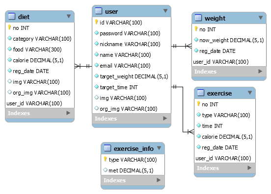
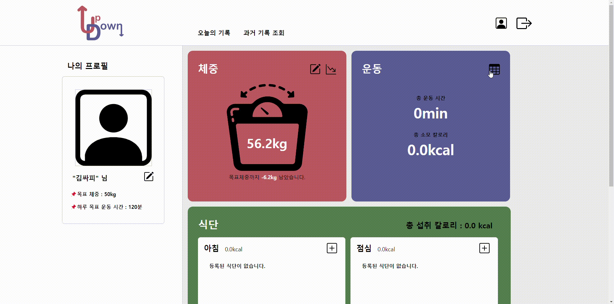

# ■ PJT-FINAL-D-KSY-KYK

> 프로젝트 공통 README

## 프로젝트 개요

### SSAFY 1학기 최종 프로젝트

<br>

### ✔팀원 구성 및 역할 분담

<table align="center">
    <tr align="center">
        <td style="min-width: 220px;">
            <a href="https://github.com/sunyoung315">
              
              <br />
              <b>김선영(팀장) </b>
            </a>
        </td>         
        <td style="min-width: 220px;">
            <a href="https://github.com/yukyung531">
              
              <br />
              <b>권유경</b>
            </a> 
        </td>
      </tr>
    <tr align="left">
        <td>       
        [Back-end & Front-end]<br>
            • DB 모델링<br>
            • vue3-apexcharts 활용(체중 변동 조회 기능)<br>
            • DTO, Controller, Service, DAO, Mapper 구현 <br>
              &nbsp; &nbsp;(exercise,user 관련 기능)<br> 
            • 로그인 기능 구현<br>
            • 운동 검색 기능 구현(csv파일 활용)<br>
            • 운동 등록, 조회, 수정, 삭제 기능 구현<br>
         	• 라우터 설계 및 기본 틀 잡기<br/>
            • 폰트 및 부트스트랩 적용<br>
            • 운동 관련 유효성 검사 기능<br>
            • 로고 및 파비콘 제작<br>
            • 설계 예상 피그마 제작<br>
            • css 적용<br>
    	</td>
   		<td> 
          [Back-end & Front-end]<br>
            • DB 모델링<br>
            • 영양 성분 API 활용(음식 검색 기능 구현)<br>
            • v-calendar 활용(일주일 간 기록 조회 기능 구현)<br>
            • DTO, Controller, Service, DAO, Mapper 구현<br>
              &nbsp; &nbsp;(weight, diet 관련 기능)<br>  
            • 파일 업로드 기능 구현<br>
            • 요구서 및 README 작성<br/>
            • 식단 등록, 조회, 수정, 삭제 기능 구현<br>
            • 식단 및 회원가입 관련 유효성 검사 기능<br>
            • css 적용<br>
        </td>       
	</tr>
</table>

<br/>

### ✔프로젝트 요구사항

- 기존 진행한 관통 프로젝트의 요구사항을 정리하고 페어 별로 프로젝트에 적용할 아이디어를 추가하여 Final Project를 완성한다. 
- SpringBoot와 MyBatis연동을 활용한 RestAPI 서버 구현 
- Vue3버전을 활용한 SPA 클라이언트 구현

<br>

### ✔프로젝트 목표

- 웹 아키텍처를 이해하고 이를 활용하여 웹 프로젝트를 설계하고 구현할 수 있다.
- SpringBoot와 Vue를 이해하고 활용할 수 있다.
- Rest API와 VueRouter을 활용하여 SPA 방식으로 프로젝트를 구성할 수 있다. 
- 기존 관통 프로젝트에 새로운 아이디어를 추가하여 과정에서 배운 기술들을 다양하게 구현해 본다.

<br>

### ✔기술 스택


<br>

### ✔UI 설계


<br>

### ✔ERD (Entity-Relationship Digram)



<br>

### ✔요구사항 명세서


<br>

### ✔URL

|     URL 패턴     |         역할         |
| :--------------: | :------------------: |
|      /user       | 전체 사용자 가져오기 |
|   /user/login    |     로그인 기능      |
|   /user/signup   |    회원가입 기능     |
|   /user/modify   | 개인 정보 수정 기능  |
| /user/unregister |    회원 탈퇴 기능    |

|    URL 패턴    |          역할          |
| :------------: | :--------------------: |
|    /weight     |  당일 체중 조회 기능   |
| /weight/upload |     체중 등록 기능     |
| /weight/modify |     체중 수정 기능     |
|  /weight/list  | 7일간의 체중 기록 조회 |

|        URL 패턴         |                         역할                         |
| :---------------------: | :--------------------------------------------------: |
|        /exercise        |           특정 날짜의 전체 운동 기록 조회            |
|     /exercise/{no}      |               운동 기록 한 개 가져오기               |
|    /exercise/modify     |                선택한 운동 기록 수정                 |
|  /exercise/remove/{no}  |                선택한 운동 기록 삭제                 |
| /exercise/search/{word} | 입력한 키워드를 포함하는 운동명의 운동 정보 가져오기 |
| /exercise/search/{type} |          운동명이 동일한 운동 정보 가져오기          |

|     URL 패턴      |            역할             |
| :---------------: | :-------------------------: |
|       /diet       |     하루 식단 기록 조회     |
|   /diet/upload    |       식단 등록 기능        |
|   /diet/modify    |    선택한 식단 기록 수정    |
| /diet/remove/{no} |    선택한 식단 기록 삭제    |
|  /diet/breakfast  | 하루 중 아침 식단 기록 조회 |
|    /diet/lunch    | 하루 중 점심 식단 기록 조회 |
|   /diet/dinner    | 하루 중 저녁 식단 기록 조회 |
|    /diet/snack    | 하루 중 간식 식단 기록 조회 |
|    /diet/{no}     |     식단 하나 가져오기      |

|  URL 패턴   |       역할       |
| :---------: | :--------------: |
| /img/regist | 파일 업로드 기능 |

<br>

---

<br>

### ✔폴더 구조

##### 📂 SpringBoot 폴더 구조

```
📂 SSAFIT
   ㄴ 📂 src/main/java
       ㄴ 📂 com.ssafy.updown
          ㄴ 📂 config
             ㄴ 📄 DBConfig.java
             ㄴ 📄 SwaggerConfig.java
             ㄴ 📄 WebConfig.java
          ㄴ 📂 controller
             ㄴ 📄 DietController.java
             ㄴ 📄 ExerciseController.java
             ㄴ 📄 FileController.java
             ㄴ 📄 UserController.java
             ㄴ 📄 WeightController.java
          ㄴ 📂 model   
              ㄴ 📂 dao
                 ㄴ 📄 DietDao.java
                 ㄴ 📄 ExerciseDao.java
                 ㄴ 📄 UserDao.java
                 ㄴ 📄 Weight.java
              ㄴ 📂 dto
                 ㄴ 📄 Diet.java
                 ㄴ 📄 Exercise.java
                 ㄴ 📄 ExerciseInfo.java       
                 ㄴ 📄 Img.java
                 ㄴ 📄 User.java
                 ㄴ 📄 Weight.java  
              ㄴ 📂 service
                 ㄴ 📄 DietService.java
                 ㄴ 📄 DietServiceDaoImpl.java      
                 ㄴ 📄 ExerciseService.java
                 ㄴ 📄 ExerciseServiceDaoImpl.java
                 ㄴ 📄 UserService.java
                 ㄴ 📄 UserServiceImpl.java
                 ㄴ 📄 WeightService.java
                 ㄴ 📄 WeightServiceImpl.java
   ㄴ 📂 src/main/resource
      ㄴ 📂 mappers
         ㄴ 📄 DietMapper.xml
         ㄴ 📄 ExerciseMapper.xml
         ㄴ 📄 UserMapper.xml         
         ㄴ 📄 WeightMapper.xml
      ㄴ 🌿 application.properties
   ㄴ 📄 pom.xml 
```

<br/>

##### 📂Vue 폴더 구조

```
📂 UPDOWN-VUE
   ㄴ 📂 src
       ㄴ 📂 asset
         ㄴ 📂 bootstrap-icon
         ㄴ 📂 image          
       ㄴ 📂 components
       	 ㄴ 📂 common
       	   ㄴ 🔹 TheAside.vue
       	   ㄴ 🔹 TheFooter.vue
       	   ㄴ 🔹 TheHeader.vue
         ㄴ 📂 diet  
           ㄴ 🔹 DietBreakFast.vue
           ㄴ 🔹 DietLunch.vue
           ㄴ 🔹 DietDinner.vue
           ㄴ 🔹 DietSnack.vue
           ㄴ 🔹 DietDetail.vue
           ㄴ 🔹 DietModify.vue
           ㄴ 🔹 DietUpload.vue
           ㄴ 🔹 DietSearch.vue
           ㄴ 🔹 DietView.vue           
         ㄴ 📂 exercise
           ㄴ 🔹 ExerciseDetail.vue
           ㄴ 🔹 ExerciseModify.vue
           ㄴ 🔹 ExerciseUpload.vue
           ㄴ 🔹 ExerciseSearch.vue
           ㄴ 🔹 ExerciseList.vue
           ㄴ 🔹 ExerciseView.vue   
         ㄴ 📂 record
           ㄴ 🔹 RecordDiet.vue
           ㄴ 🔹 RecordExercise.vue
           ㄴ 🔹 RecordWeight.vue 
         ㄴ 📂 user
           ㄴ 🔹 Login.vue
           ㄴ 🔹 MyProfile.vue
           ㄴ 🔹 MyprofileModify.vue 
         ㄴ 📂 weight  
           ㄴ 🔹 WeightDetail.vue
           ㄴ 🔹 WeightModify.vue
           ㄴ 🔹 WeightUpload.vue
           ㄴ 🔹 WeightGraph.vue
           ㄴ 🔹 WeightView.vue 
       ㄴ 📂 router
       	   ㄴ 🔸 index.js
       ㄴ 📂 stores
           ㄴ 🔸 diet.js
           ㄴ 🔸 exercise.js
           ㄴ 🔸 user.js
           ㄴ 🔸 weight.js
       ㄴ 📂 views
           ㄴ 🔹 HomeView.vue
           ㄴ 🔹 MyProfileView.vue
           ㄴ 🔹 RecordView.vue
           ㄴ 🔹 StartView.vue
           ㄴ 🔹 TodayView.vue
       ㄴ 🔹 App.vue
       ㄴ 🔸 main.js          
```

<br/>

### ✔구현결과

#### 🔹주요 기능


##### • 체중 등록/ 수정/ 조회

   - 체중 등록
     - 메인 페이지에 보여지는 체중은 매일 초기화 된다.
     - 매일 체중을 등록할 수 있다.
     - 0보다 작거나 같은 수는 등록할 수 없다.
   - 체중 수정
     - 잘못 입력했을 경우 등록한 체중을 수정할 수 있다.
   - 체중 조회
     - 체중을 등록하면 메인 페이지에서 오늘의 체중을 바로 확인할 수 있다.
     - '그래프' 아이콘을 누르면 지난 일주일 간의 체중 변동을 한눈에 볼 수 있다.




##### • 운동 등록 및 조회

- 검색 기능을 통해 운동 종류를 검색할 수 있다.(운동 csv 파일 활용)
  - 각 운동의 단위체중당 에너지 소비량을 보여준다.
- 검색을 통해 운동 종류를 선택하여 운동 시간을 입력하면, 사용자의 체중당 에너지 소비량을 계산해준다.
- 검색 기능을 사용하지 않고, 직접 등록할 수도 있다.
- 값을 입력하지 않으면 등록되지 않는다.


##### • 운동 수정

- 등록한 운동 기록을 수정할 수 있다.

 


##### • 운동 삭제

- 등록한 운동 기록을 삭제할 수 있다.


##### • 식단 등록 및 조회

- 검색 기능을 통해 음식을 검색할 수 있다.(영양 성분 api 활용)
  - 각 음식의 100g 당 열량을 보여준다.
- 검색을 통해 음식을 선택하여 섭취량을 입력하면, 음식 칼로리를 계산해준다.
- 검색 기능을 사용하지 않고, 직접 등록할 수도 있다.
- 값을 입력하지 않으면 등록되지 않는다.
- 사진 첨부도 가능하다.
- 등록 화면에서 첨부한 사진 미리보기가 가능하다.
- 가장 마지막에 첨부한 사진이 식단 목록에서 보여진다.
- 모든 식단의 총 칼로리를 보여준다.


##### • 식단 수정

- 등록한 식단 기록을 수정할 수 있다.


##### • 식단 삭제

- 등록한 식단 기록을 삭제할 수 있다.


##### • 과거 기록 조회

- 과거에 기록한 내용을 조회할 수 있다.(v-calender 활용)
- 선택한 날짜의 체중, 운동, 식단 기록을 한 눈에 볼 수 있다.


#### 🔹일반 기능


##### • 회원가입 및 로그인

- 아이디, 닉네임, 이메일이 중복되지 않으면 회원가입이 가능하다.
- 선택사항(프로필 사진)을 제외하고 모든 정보를 입력해야 회원가입이 가능하다.


##### • 프로필 수정

- 사용자 정보를 수정할 수 있다.
- id를 제외한 모든 정보을 수정할 수 있다.
